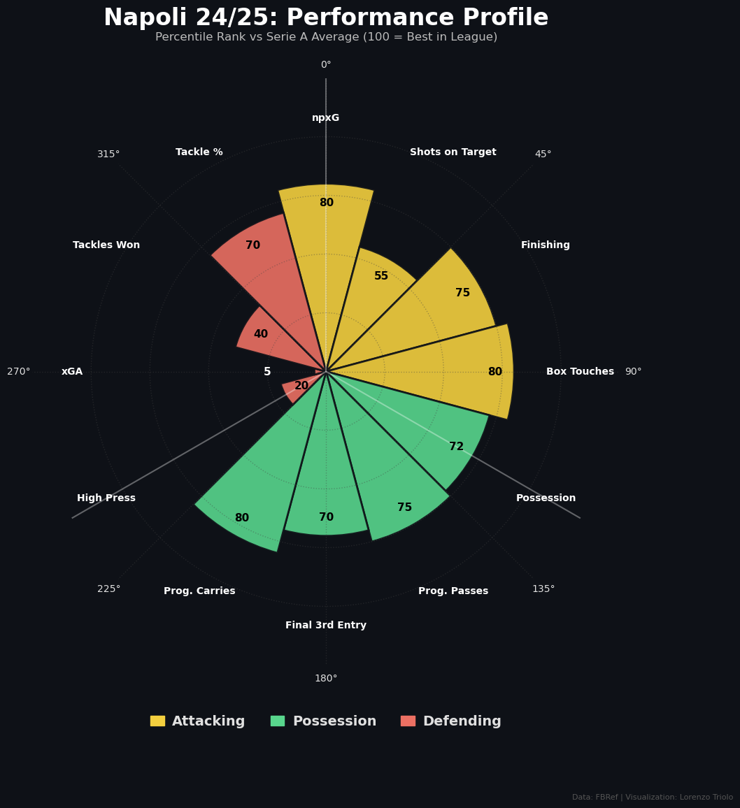

# DataVisualization-Project
# Aesthetics vs Efficiency: Is the "Beautiful Game" a Trap? ⚽📊

*(Fig. 1: The Efficiency Model - Napoli's 24/25 Percentile Rank Profile)*

> **Course:** Data Visualization | MSc in Data Science, University of Milano-Bicocca
> **Academic Year:** 2025/2026
> **Author:** Lorenzo Triolo

---

## 📌 Project Description

This project presents a data-driven investigation into one of the most polarizing debates in Italian football: **"Giochisti" (Aesthetes) vs "Risultatisti" (Pragmatists)**.
Using advanced metrics from the **2024/25 Serie A Season**, the analysis challenges the conventional wisdom that ball possession and territorial dominance differ from actual success.

The project explores the concept of **"Sterile Dominance"**: why teams with elite possession metrics often fail to achieve results, while pragmatic sides maximize efficiency. Through unsupervised learning (K-Means) and comparative visual analytics, the study identifies distinct **Tactical Identities** and quantifies the **Efficiency Gap** between creating chances (xG) and converting them.

## 🎯 Project Objectives

* **Deconstruct "Sterile Dominance":** Quantify the disconnect between aesthetic metrics (Ball Possession %, Field Tilt) and concrete output (Points, Goals).
* **Map Tactical Identities:** Classify Serie A teams into 4 distinct archetypes (e.g., *Patient Strategists* vs *Elite Aggressors*) using **K-Means Clustering** on style metrics.
* **Measure Conversion Efficiency:** Reveal the "hidden" performance by analyzing the divergence between Expected Goals (xG) and Actual Goals to identify clinical overperformers versus wasteful sides.
* **Champion's Profile Analysis:** A case study on **Napoli** (visualized above), demonstrating how defensive solidity (xGA overperformance) outweighed offensive volume.

## 🔬 Methodologies & Technical Framework

The analysis is built on a custom **ETL pipeline** and statistical framework developed in Python:

### 1. Data Pipeline (ETL)
* **Ingestion:** Integration of 7 distinct datasets from **FBref (StatsBomb)** covering Shooting, Passing, Possession, and Defense.
* **Parsing & Cleaning:** Custom parsers (`SerieA preprocessing.ipynb`) handles European formatting, sanitizes string keys, and merges data into a consolidated structure of **20 teams x 70 variables**.
* **Feature Engineering:**
    * **Per 90 Standardization:** All volume metrics normalized to 90-minute averages for fair comparison.
    * **Efficiency Ratios:** Calculation of conversion rates (e.g., *Tackle Win %*, *Passing Accuracy*).

### 2. Statistical Analysis
* **Z-Score Normalization:** Applied to heterogeneous metrics (e.g., *Possession %* vs *Shots on Target*) to create comparable scales for **Radar Charts**.
* **Unsupervised Learning (Clustering):** Implementation of **K-Means** to segment teams based on `Directness`, `PPDA proxies`, and `Possession`, revealing the league's tactical structure beyond simple rankings.
* **Residual Analysis:** Measuring the "Luck/Skill" factor by calculating the residuals between Expected (xG/xGA) and Actual outcomes.

## 🛠️ Technologies Used

* **Language:** Python 3.11
* **Data Manipulation:** `Pandas`, `NumPy` (Data cleaning, merging, type casting).
* **Machine Learning:** `Scikit-learn` (StandardScaler, K-Means Clustering).
* **Visualization:** `Matplotlib`, `Seaborn` (Static, publication-quality charts). In addition **DataWrapper** was also used for some kind of visualizations
* **Data Source:** **FBref** (via StatsBomb) & **Understat**.

## 📥 How to View the Code

You don't need to be a developer to view the analysis.
1.  **View the Notebooks:** Click on `SerieA preprocessing.ipynb` or the main visualization notebook directly in the file list above to see the code and charts rendered in the browser.
2.  **Download the Project:** Click the green **Code** button (top right) and select **Download ZIP** to get all data and scripts on your computer.

---
*This project is distributed under a Creative Commons CC BY-NC-SA 4.0 license.*
